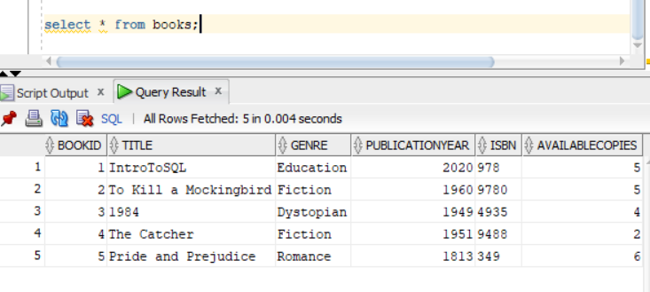
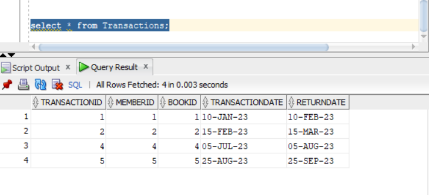
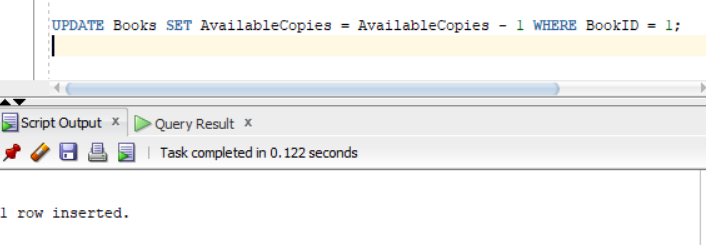

### Problem Statement: Library Management System

The task is to design and implement a **Library Management System** that tracks the books available in the library, their authors, library members, and transactions (borrowed books).

## Requirements:

1. **Library Membership Management**:
   - Register new members with their details (FirstName, LastName, Email, PhoneNumber, JoinDate).
   - Each member has a unique MemberID.

2. **Book Management**:
   - Store information about books including the title, genre, publication year, ISBN, and available copies.
   - Each book has a unique BookID.

3. **Author Information**:
   - Store details about authors including their first name, last name, and nationality.
   - Each author is assigned a unique AuthorID.

4. **Book-Author Relationship**:
   - A book can have multiple authors, and an author can write multiple books.
   - The system should support this many-to-many relationship between books and authors.

5. **Transaction Management**:
   - Record when a member borrows a book, including the transaction date and the return date.
   - The system must track which books are currently borrowed by members, and manage the number of available copies.

6. **Queries**:
   - List all books along with their available copies.
   - Retrieve all the books borrowed by a particular member.
   - Get all authors who have written a particular book.
   - Track the borrowing history of a specific book or member.

This system aims to improve the management and organization of library resources, providing efficient tracking of books, authors, and member transactions.

Member table
```sql
CREATE TABLE Members (
    MemberID INT PRIMARY KEY,
    FirstName VARCHAR2(100),
    LastName VARCHAR2(100),
    Email VARCHAR2(100),
    PhoneNumber VARCHAR2(15),
    JoinDate DATE
);
```

## Book table

```sql
CREATE TABLE Books (
    BookID INT PRIMARY KEY,
    Title VARCHAR2(255),
    Genre VARCHAR2(100),
    PublicationYear INT,
    ISBN VARCHAR2(13),
    AvailableCopies INT
);
```

## Author's table

```sql
CREATE TABLE Authors (
    AuthorID INT PRIMARY KEY,
    FirstName VARCHAR2(100),
    LastName VARCHAR2(100),
    Nationality VARCHAR2(50)
);
```
## Transaction's table
```sql

CREATE TABLE Transactions (
    TransactionID INT PRIMARY KEY,
    MemberID INT,
    BookID INT,
    TransactionDate DATE,
    ReturnDate DATE,
    FOREIGN KEY (MemberID) REFERENCES Members(MemberID),
    FOREIGN KEY (BookID) REFERENCES Books(BookID)
);
```

## BooksAuthor table
```sql

CREATE TABLE BookAuthors (
    BookID INT,
    AuthorID INT,
    PRIMARY KEY (BookID, AuthorID),
    FOREIGN KEY (BookID) REFERENCES Books(BookID),
    FOREIGN KEY (AuthorID) REFERENCES Authors(AuthorID)
);
```
### Insertion
```sql
INSERT INTO Members (MemberID, FirstName, LastName, Email, PhoneNumber, JoinDate)
VALUES
(5, 'Charlie', 'Brown', 'brown@example.com', '0787574123', TO_DATE('2021-08-20', 'YYYY-MM-DD'));

INSERT INTO Book (BookID, Title, Genre, PublicationYear, ISBN, AvailableCopies)
VALUES (5, 'Pride and Prejudice', 'Romance', 1813, '349', 6);

INSERT INTO Authors (AuthorID, FirstName, LastName, Nationality)
VALUES (5, 'Judith', 'Aust', 'British');


INSERT INTO Transactions (TransactionID, MemberID, BookID, TransactionDate, ReturnDate)
VALUES
(2, 2, 2, TO_DATE('2023-02-15', 'YYYY-MM-DD'), TO_DATE('2023-03-15', 'YYYY-MM-DD'));

INSERT INTO BookAuthors (BookID, AuthorID)
VALUES
(5, 5);
```
```sql
UPDATE Books SET AvailableCopies = AvailableCopies - 1 WHERE BookID = 1;
```


